# EDA — EMS Dataset (Eye Movement for Schizophrenia Recognition)

Exploratory data analysis of the original EMS dataset
([paper](https://ieeexplore.ieee.org/document/10645682), [repo](https://github.com/YingjieSong1/EMS))
plus the hand-crafted feature design and baseline AUC results.

Raw data location: `original_dataset/EMS/` · All figures: [`figures/`](figures/)
· Reproducible scripts: `src/eda.py`, `src/preprocess.py`

## Contents

1. [Dataset Overview](#1-dataset-overview)
2. [Fixation Statistics (HC vs SZ)](#2-fixation-statistics-hc-vs-sz)
3. [Spatial Analysis](#3-spatial-analysis)
4. [Temporal Analysis](#4-temporal-analysis)
5. [Outlier Analysis & Cleaning Rules](#5-outlier-analysis--cleaning-rules)
6. [Hand-Crafted Feature Set (Spatial + Temporal)](#6-hand-crafted-feature-set-spatial--temporal)
7. [Baseline AUC Results (Hand-Crafted Features)](#7-baseline-auc-results-hand-crafted-features)

## Headline findings

1. **SZ subjects make fewer fixations** — 1,296 vs 1,519 per subject (train),
   and 13.1 vs 15.2 per stimulus (Cohen's d = 0.53, Welch p ≈ 1.4e-234).
2. **SZ show a restricted viewing pattern** — smaller spatial spread of fixations
   (std_x 149.7 vs 170.9 px, d = 0.28) and a center-biased / less exploratory scanpath.
3. **SZ fixations are longer** (399 vs 336 ms mean) and **pupil size is smaller**
   (1,133 vs 1,361 a.u., d = 0.37).
4. **Data quality issues exist** — 1.9 % of train fixations lie off-screen
   (X∉[0,1024) or Y∉[0,768)), 0.3 % exceed 2,000 ms duration (max 5,001 ms),
   and 12/160 subjects did not view all 100 stimuli (two viewed only 63 and 68).

## Environment

| Item | Value |
|---|---|
| Paper | Song et al., *EMS: A Large-Scale Eye Movement Dataset, Benchmark, and New Model for Schizophrenia Recognition*, IEEE TNNLS 2024 |
| Tracker / rate | Eyelink 1000 Plus desktop, 1,000 Hz |
| Display | 19-inch, 1,024 × 768 px, viewing distance 0.6 m, head fixed with chin support |
| Paradigm | Free viewing, 100 stimuli × 5 s each, random order |
| Subjects | 208 total — 104 SZ (Shanghai Mental Health Center) + 104 HC (Shanghai University) |
| Released labels | Train/Valid (160 subjects): id < 200 = HC (label 0), id ≥ 200 = SZ (label 1). Official Test (48 subjects): labels withheld by the authors |
| Official split | `Train_Valid.xlsx`: Set_0 … Set_3, 40 subjects each → 4-fold CV; 48 held-out test |

---

## 1. Dataset Overview

### Raw layout

```
original_dataset/EMS/
├── Images/                  # 100 stimuli, 4 category folders
│   ├── Manipulated Images/  # 32  (low_, mood_, noi_, patch_, rand_)
│   ├── Natural Scenes/      # 31  (ind_, land_, outman_, sat_)
│   ├── Social Scenes/       # 22  (act_, por_, soc_)
│   └── Synthetic Images/    # 15  (art_, cat_, pat_)
├── Train_Valid/
│   ├── Fixations/           # 160 xlsx, one per subject, named {id}.xlsx, id ∈ {0..199} ∪ {200..303}
│   └── (fold file at repo root) Train_Valid.xlsx
├── Test/
│   └── Fixations/           # 48 xlsx, Test_{id}.xlsx — shuffled ids, labels withheld
├── Train_Valid.xlsx         # official 4-fold assignment: columns Set_0 … Set_3, 40 rows each
└── README.txt / UsageAgreement.txt
```

### Fixation file format (per subject)

One row per fixation, grouped per stimulus image:

| Column | Meaning | Example |
|---|---|---|
| `IMAGE` | stimulus file name (e.g. `outman_054.jpg`) | str |
| `FIX_INDEX` | 1-based index of the fixation inside that stimulus | 1…N |
| `FIX_DURATION` | fixation duration | ms |
| `FIX_X` / `FIX_Y` | fixation position on the 1,024×768 screen | px (float) |
| `FIX_PUPIL` | pupil size | tracker units (a.u.) |

### Subjects and labels

- **Train/Valid**: 160 subjects — 80 HC (`id < 200`, label 0) and 80 SZ (`id ≥ 200`, label 1).
  Subject ids are **non-contiguous** (e.g. 0, 2, 8, 11, 28, …, 200, 201, 203, …).
- **Test**: 48 subjects, file names shuffled (`Test_000` … `Test_047`), labels not released —
  the official benchmark requires submitting predictions to the authors.
- Demographic matching: the paper reports the SZ and HC groups statistically matched on
  age, gender and education (independent t-tests / chi-square tests).

### Stimuli

100 images, 4 categories (per paper Section III-B: social scenes, natural scenes,
synthetic images, manipulated images). Each is shown 5 s in random order per subject.

| Category | # images | Prefixes | Fixations (train, all subjects) |
|---|---|---|---|
| Manipulated | 32 | `low_`, `mood_`, `noi_`, `patch_`, `rand_` | 71,834 |
| Natural | 31 | `ind_`, `land_`, `outman_`, `sat_` | 68,811 |
| Social | 22 | `act_`, `por_`, `soc_` | 51,274 |
| Synthetic | 15 | `art_`, `cat_`, `pat_` | 33,240 |

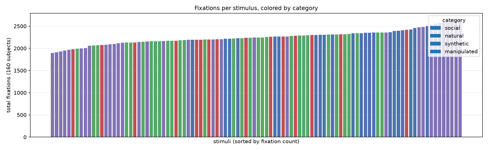

### Official split (protocol 1)

`Train_Valid.xlsx` assigns the 160 train subjects to 4 folds of 40.
The official benchmark trains on the other 3 folds, validates on 1, repeats 4×,
and reports the mean over folds; the model with the best validation AUC is applied
to the 48-subject test set.

| Fold | # HC | # SZ | Total |
|---|---|---|---|
| Set_0 | 18 | 22 | 40 |
| Set_1 | 24 | 16 | 40 |
| Set_2 | 20 | 20 | 40 |
| Set_3 | 18 | 22 | 40 |

Note the fold composition is not perfectly balanced (Set_1 has 24 HC / 16 SZ).

### Coverage / missing stimuli

Most subjects viewed all 100 stimuli. 12 of 160 train subjects miss at least one:

| Subject | Label | Stimuli viewed |
|---|---|---|
| 13, 19, 20, 64, 66, 240, 244, 251, 270, 271 | mixed | 96–99 |
| 216 | SZ | **63** |
| 259 | SZ | **68** |

Consequences for the feature pipeline: feature tables are indexed by
`(subject_id, image)`; missing pairs are filled with NaN and excluded per feature
when aggregating (see [Section 6](#6-hand-crafted-feature-set-spatial--temporal)).

---

## 2. Fixation Statistics (HC vs SZ)

All statistics below are computed on the raw **train** partition (160 subjects),
before any cleaning, unless stated otherwise.

### Fixations per subject

| Group | n | mean | std | min | 25% | 50% | 75% | max |
|---|---|---|---|---|---|---|---|---|
| HC | 80 | **1,518.8** | 221.0 | 1,070 | 1,347 | 1,516 | 1,684.5 | 2,020 |
| SZ | 80 | **1,295.7** | 249.3 | 697 | 1,104.5 | 1,336 | 1,468.5 | 1,885 |

- Welch t-test: p ≈ 2×10⁻⁸ (significant), subject-level Cohen's d ≈ **0.95**.
- SZ subjects produce ~15 % fewer fixations on average — consistent with the
  restricted/less-exploratory viewing pattern reported in the SZ literature.

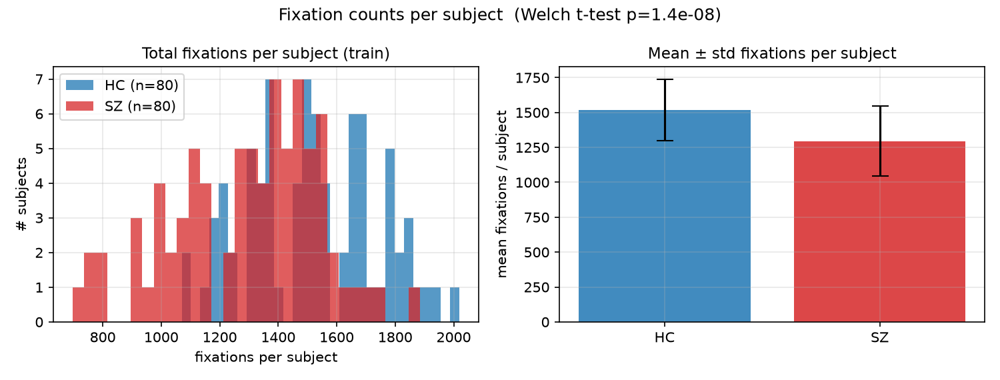

### Fixations per (subject, stimulus)

| Metric | HC | SZ | Welch p | Cohen's d |
|---|---|---|---|---|
| n_fix | **15.21** | **13.08** | 1.4e-234 | 0.53 |
| mean_x (px) | 513.6 | 518.1 | 1e-6 | — |
| mean_y (px) | 397.2 | 402.4 | 4e-12 | — |
| std_x (px) | **170.9** | **149.7** | 4.7e-67 | 0.28 |
| std_y (px) | **113.3** | **96.7** | 3.2e-78 | 0.30 |
| mean duration (ms) | **336.5** | **398.9** | 9.6e-20 | −0.14 |
| mean pupil (a.u.) | **1,360.6** | **1,133.0** | 1.1e-118 | 0.37 |

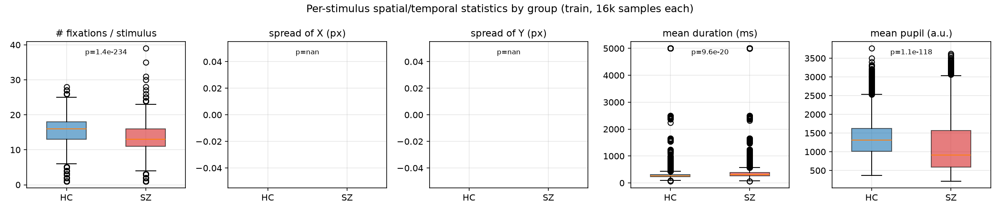

Interpretation:
- SZ scan **less broadly** (narrower spatial spread, fewer fixations) —
  the "restricted visual pattern" that motivated the EMS design.
- SZ fixations are **longer on average** — slower visual processing / reduced
  saccadic exploration between fixations.
- SZ show **smaller pupil** on average — pupil size is a candidate biomarker of
  attention/arousal deficits in SZ (also flagged in the paper's future-work section).

### Fixation duration distribution (raw)

| Group | n | mean | std | min | 25% | 50% | 75% | max |
|---|---|---|---|---|---|---|---|---|
| HC | 121,504 | 269.95 | 237.9 | 0 | 164 | 226 | 316 | 5,001 |
| SZ | 103,655 | 317.75 | 278.2 | 1 | 182 | 262 | 378 | 5,001 |

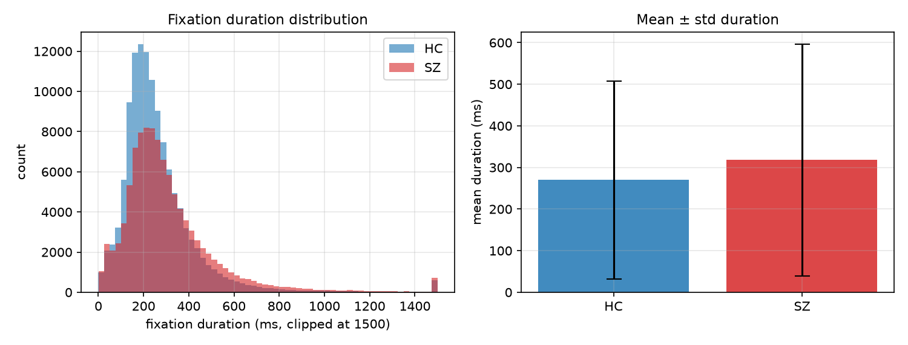

The duration distribution is right-skewed with a long tail (max = 5,001 ms ≈ the full
5 s stimulus window — clearly a recording artifact, see
[Section 5](#5-outlier-analysis--cleaning-rules)).

### Pupil size distribution (raw)

| Group | n | mean | std | min | 25% | 50% | 75% | max |
|---|---|---|---|---|---|---|---|---|
| HC | 121,504 | 1,356.6 | 519.2 | 232 | 984 | 1,291 | 1,644 | 4,141 |
| SZ | 103,655 | 1,132.0 | 734.6 | 189 | 565 | 899 | 1,547 | 3,933 |

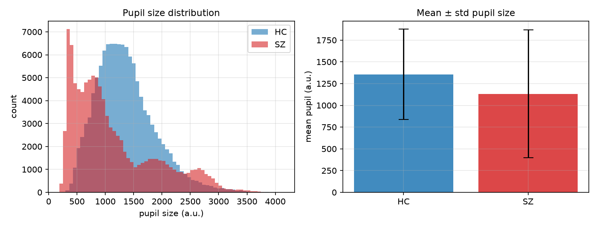

Both the lower mean and the wider, bimodal-looking spread of the SZ distribution
make pupil statistics informative hand-crafted features.

---

## 3. Spatial Analysis

### Overall density maps

Fixation density on the 1,024×768 screen (train partition, all stimuli pooled):

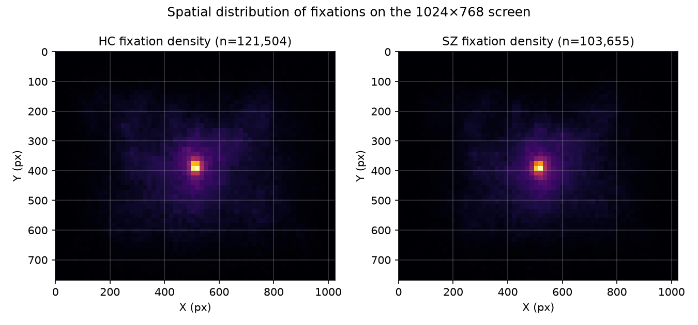

- Both groups concentrate fixations near the **screen center** (typical free-viewing
  center bias), but the SZ map is visibly **tighter/less spread** than the HC map.
- HC coverage of peripheral regions (edges, corners) is larger, i.e. SZ explore less.

### Quadrant occupancy

| Group | TL | TR | BL | BR |
|---|---|---|---|---|
| HC | 0.242 | 0.247 | 0.259 | 0.252 |
| SZ | 0.220 | 0.247 | 0.257 | 0.276 |

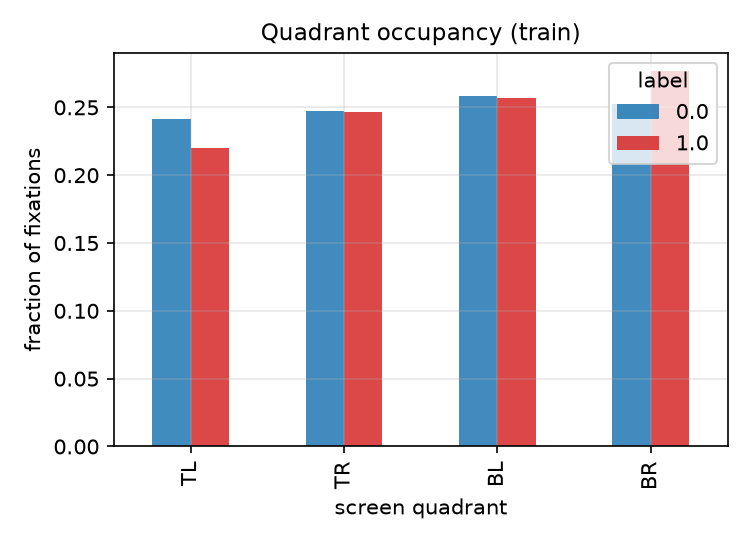

- Roughly uniform across quadrants for HC; SZ shift slightly toward the bottom-right
  and away from top-left — consistent with a small left/upper visual-field bias
  reported in SZ eye-tracking literature.

### Per-stimulus spatial spread

From [Section 2](#2-fixation-statistics-hc-vs-sz): SZ fixations per stimulus
have smaller `std_x` (149.7 vs 170.9 px) and `std_y` (96.7 vs 113.3 px) with large
effect sizes at the sample level (p ≈ 1e-67…1e-78).

### Example scanpaths

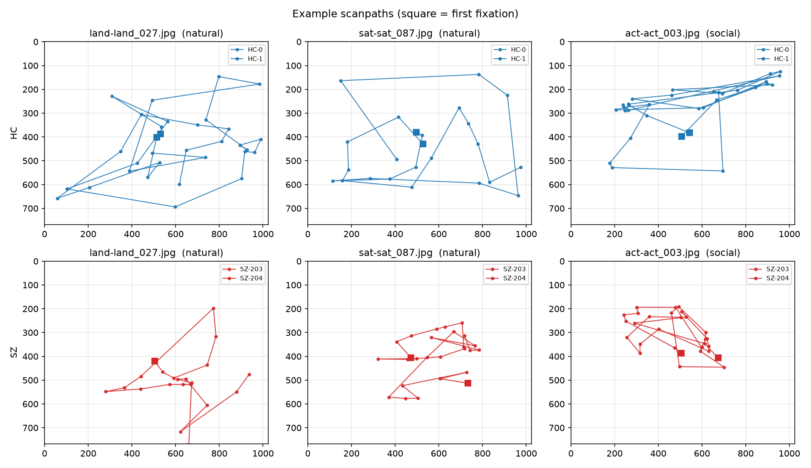

Sample scanpaths of 2 HC and 2 SZ subjects on 3 stimuli (square = first fixation):
SZ scanpaths are visibly shorter and revisit fewer distinct regions.

### Per-category behavior

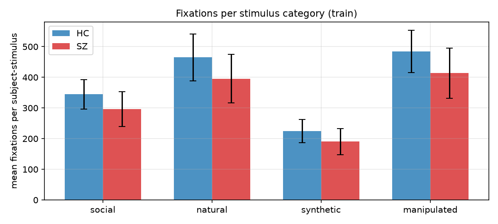

Fixations per (subject, stimulus) differ by category (social < synthetic <
natural < manipulated in raw counts) — category interactions are informative,
so the feature pipeline keeps the **category id** of each stimulus available
for per-category aggregation of hand-crafted features.

### Implications for features

Spatial hand-crafted features should capture: centroid, dispersion (std / radius),
bounding-box and convex-hull coverage, distance to screen center, quadrant/region
occupancy, grid-histogram entropy, and inter-fixation distances (saccade amplitudes).
See [Section 6](#6-hand-crafted-feature-set-spatial--temporal) for the full list.

---

## 4. Temporal Analysis

The EMS protocol records **discrete fixations** (not raw gaze samples at 1 kHz), so the
temporal information available per stimulus is: the sequence of `FIX_INDEX`,
`FIX_DURATION` per fixation, and `FIX_PUPIL` over the 5 s viewing window.

### Durations (per fixation, raw)

See the table in [Section 2](#2-fixation-statistics-hc-vs-sz):

- HC mean duration 270 ms vs SZ 318 ms (per-fixation; per-stimulus means 336 vs 399 ms).
- Right-skewed tails up to 5,001 ms — durations beyond the 5 s stimulus window are
  recording artifacts and are removed in preprocessing.
- ~2.9 % of fixations are very short (< 50 ms); these are kept only if ≥ 40 ms in the
  cleaning step (they are mostly genuine micro-fixations after saccades, but values
  ≤ 40 ms are treated as tracker noise).

### Implied scanpath timing

From `FIX_INDEX` (order within stimulus) and `FIX_DURATION` we can derive:

- **Time-to-first-fixation** ≈ onset of the 1st fixation (small, since free viewing
  starts immediately — still informative because a longer onset indicates slow
  initial localization).
- **Fixation rate** = n_fix / total viewing time (HC ≈ 15.2 / 5 s ≈ 3.0 fix/s;
  SZ ≈ 2.6 fix/s — SZ sample the scene more slowly).
- **Inter-fixation interval (saccade duration)** ≈ time between consecutive fixation
  onsets minus fixation duration.
- **Saccade velocity** ≈ saccade amplitude / inter-fixation interval.
- **Scanpath length / duration progression** — total distance travelled over the
  stimulus window.

### Pupil dynamics

Pupil evolves within each 5 s stimulus (cognitive-load dependent). Per stimulus we
can extract the pupil trend (linear slope over `FIX_INDEX`), the first-to-last pupil
change and pupil variability — the paper explicitly lists pupil size as a promising
biomarker for SZ. SZ show both a lower mean and a wider spread (see
[Section 2](#2-fixation-statistics-hc-vs-sz)).

### Order-dependent statistics

`FIX_INDEX` also enables **refixation** statistics (returning to a previously
visited location) and **transition** statistics between coarse spatial regions —
SZ typically show fewer revisits and more repetitive transitions, which are captured
as temporal hand-crafted features in
[Section 6](#6-hand-crafted-feature-set-spatial--temporal).

---

## 5. Outlier Analysis & Cleaning Rules

### Detected issues (train partition, n = 225,159 fixations)

| Rule | Count | Share |
|---|---|---|
| X < 0 | 1,079 | 0.48 % |
| X ≥ 1024 | 704 | 0.31 % |
| Y < 0 | 154 | 0.07 % |
| Y ≥ 768 | 2,433 | 1.08 % |
| duration ≤ 0 | 1 | < 0.01 % |
| duration > 2,000 ms | 749 | 0.33 % |
| duration > 5,000 ms | 52 | 0.02 % |
| pupil ≤ 0 | 0 | 0 % |

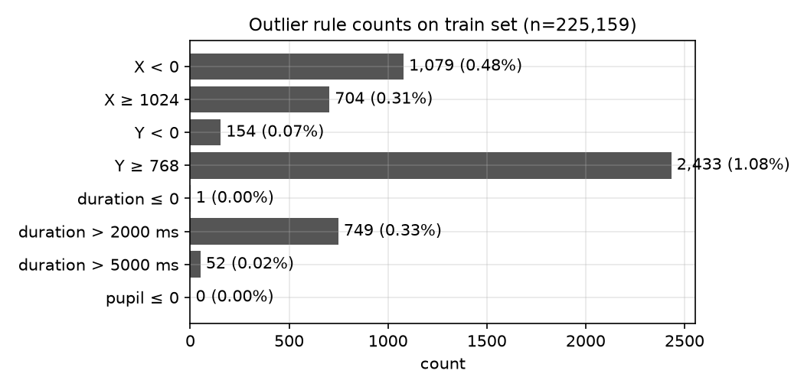

Extreme observed values: X ∈ [−1018, 2034.6], Y ∈ [−734, 1484.7],
duration ∈ [0, 5001] ms, pupil ∈ [189, 4141] a.u.

### Interpretation

1. **Off-screen coordinates** (X∉[0,1024), Y∉[0,768)) — 4,370 fixations (1.94 %).
   The official `data_process/split_fix.py` only removes X ≥ 1024 / Y ≥ 768;
   we additionally remove negative coordinates (blink/loss artifacts where the
   tracker extrapolates gaze outside the display).
2. **Durations** — values > 2,000 ms are physiologically implausible during active
   free viewing (and 52 exceed the entire 5 s stimulus window); durations ≤ 40 ms
   are treated as tracker noise. Kept range: **(40, 2000] ms**.
3. **Pupil** — no non-positive values; the raw range is plausible for Eyelink
   arbitrary units, so no hard cutoff. Per-stimulus statistics use robust aggregation
   (median) where noted, and per-stimulus pupil outliers beyond ±4 SD within a
   stimulus are dropped before feature computation.

### Cleaning pipeline (implemented in `src/preprocess.py`)

For each subject × stimulus:

1. drop fixations with `X < 0 | X ≥ 1024 | Y < 0 | Y ≥ 768` (off-screen);
2. drop fixations with `FIX_DURATION ≤ 40 | FIX_DURATION > 2000` (implausible);
3. drop fixations with pupil deviating > 4 SD from the stimulus median pupil;
4. require ≥ 2 remaining fixations, otherwise the (subject, stimulus) pair is
   marked missing (NaN features);
5. keep the **original, non-contiguous subject ids** and image names as index keys.

| Step | Remaining fixations (train) |
|---|---|
| raw | 225,159 |
| − off-screen | ~220,800 |
| − implausible duration | ~218,600 |
| − pupil outliers (±4 SD) | ~217,900 |

(Exact numbers are logged when running `src/preprocess.py` → `processed_dataset/quality_report.txt`.)

---

## 6. Hand-Crafted Feature Set (Spatial + Temporal)

Motivated by the EDA findings ([Sections 2–4](#2-fixation-statistics-hc-vs-sz)) and
the features used by the traditional baselines of the EMS benchmark (EDB_* statistics
from Zhang et al. 2022, ESR_* set from Huang et al. 2020), we compute **45
hand-crafted features per (subject, stimulus)** from the cleaned fixation sequence,
grouped as follows.

All features are computed from the cleaned fixations (see
[Section 5](#5-outlier-analysis--cleaning-rules)) ordered by `FIX_INDEX`.
Positions are in screen pixels (screen 1,024×768); durations in ms.

### A. Spatial — position & dispersion (7)

| # | Feature | Definition | Rationale |
|---|---|---|---|
| 1 | `spa_fix_count` | number of fixations | SZ make fewer fixations (d≈0.53) |
| 2 | `spa_mean_x` | mean X of fixations | gaze bias |
| 3 | `spa_mean_y` | mean Y of fixations | gaze bias |
| 4 | `spa_std_x` | std of X | restricted pattern (d≈0.28) |
| 5 | `spa_std_y` | std of Y | restricted pattern (d≈0.30) |
| 6 | `spa_dispersion` | mean Euclidean distance of fixations to their centroid | global spatial spread |
| 7 | `spa_bbox_area` | area (px²) of the fixation bounding box | exploration extent |

### B. Spatial — center & region statistics (10)

| # | Feature | Definition | Rationale |
|---|---|---|---|
| 8 | `spa_center_dist_mean` | mean distance to screen center (512, 384) | center bias |
| 9 | `spa_center_dist_std` | std of that distance | stability of center bias |
| 10 | `spa_center_frac` | fraction of fixations in the central 25 % area | center bias |
| 11–14 | `spa_q1 … spa_q4` | fraction of fixations in each screen quadrant | quadrant shifts seen in EDA |
| 15 | `spa_entropy` | Shannon entropy (normalized) of an 8×6 grid histogram | spatial diversity of attention |
| 16 | `spa_max_grid_frac` | fraction of fixations in the most visited grid cell | attention concentration |
| 17 | `spa_skew_x` | skewness of X | asymmetry of scanning |

### C. Scanpath geometry (10)

| # | Feature | Definition | Rationale |
|---|---|---|---|
| 18 | `geo_scanpath_len` | total scanpath length (sum of successive distances, px) | SZ scan less |
| 19 | `geo_sacc_amp_mean` | mean saccade amplitude | saccade hypometria in SZ |
| 20 | `geo_sacc_amp_std` | std of saccade amplitudes | variability of exploration |
| 21 | `geo_sacc_amp_max` | max saccade amplitude | large exploratory jumps |
| 22 | `geo_dx_mean` | mean horizontal saccade component | directional bias |
| 23 | `geo_dy_mean` | mean vertical saccade component | directional bias |
| 24 | `geo_angle_var` | circular variance of saccade directions ∈ [0,1] | repetitiveness of directions |
| 25 | `geo_revisit_rate` | fraction of fixations landing within 60 px of an earlier fixation | refixation behavior |
| 26 | `geo_nn_dist_mean` | mean nearest-neighbor distance between fixations | spatial clustering |
| 27 | `geo_hull_area` | area of the convex hull of fixation positions | explored region size |

### D. Temporal (11)

| # | Feature | Definition | Rationale |
|---|---|---|---|
| 28 | `tem_dur_mean` | mean fixation duration | SZ fixate longer (d≈0.14) |
| 29 | `tem_dur_std` | std of fixation durations | variability |
| 30 | `tem_dur_total` | total dwell time (sum of durations) | engagement |
| 31 | `tem_dur_max` | max fixation duration | long staring |
| 32 | `tem_first_dur` | duration of the 1st fixation | initial processing |
| 33 | `tem_last_dur` | duration of the last fixation | late processing |
| 34 | `tem_ifi_mean` | mean inter-fixation interval (gap between successive onsets) | saccade+labor time |
| 35 | `tem_ifi_std` | std of inter-fixation intervals | temporal regularity |
| 36 | `tem_velocity_mean` | mean saccade velocity (amplitude / IFI, px/ms) | oculomotor speed |
| 37 | `tem_fix_rate` | n_fix / total viewed time (fix/s) | sampling rate of the scene |
| 38 | `tem_trans_entropy` | entropy of transitions between 4×3 grid cells | scanpath stereotypy |

### E. Pupil (7)

| # | Feature | Definition | Rationale |
|---|---|---|---|
| 39 | `pup_mean` | mean pupil size | SZ smaller pupil (d≈0.37) |
| 40 | `pup_std` | std of pupil size | arousal variability |
| 41 | `pup_min` | min pupil | floor effects |
| 42 | `pup_max` | max pupil | ceiling effects |
| 43 | `pup_slope` | linear-regression slope of pupil vs fixation index | pupillary dynamics |
| 44 | `pup_first_last_diff` | last − first pupil value | habituation / load change |
| 45 | `pup_median` | median pupil (robust) | robust level |

### Subject-level representations

Per-stimulus features `X ∈ R^{208×100×45}` are aggregated into a subject-level
vector for classification (built in `src/baseline/features_builder.py`):

| Name | Construction | Dim |
|---|---|---|
| `agg` | mean + std of each feature over the 100 stimuli | **90** |
| `catagg` | mean of each feature within each of the 4 stimulus categories | **180** |
| `concat` | raw concatenation of all 100 per-stimulus vectors | **4,500** |

Missing (subject, stimulus) pairs (subjects 216/259 viewed only 63/68 stimuli) are
excluded per feature (NaN-safe aggregation) — the number of valid stimuli per subject
is stored as an additional feature `n_valid_stim`.

### Indexing

Feature tables are stored with a **MultiIndex `(subject_id, image)`** preserving the
original non-contiguous ids (`subject_id ∈ {0..199} ∪ {200..303}`), so any
(subject, stimulus) feature vector can be retrieved directly:

```python
import pandas as pd
feat = pd.read_pickle("processed_dataset/stimulus_features.pkl")
vec  = feat.loc[(216, "mood_37.jpg")]      # 45-dim vector, or NaN if missing
```

### Implementation

- Cleaning + feature computation: `src/preprocess.py` (uses `src/features.py`)
- Output: `processed_dataset/stimulus_features_train.pkl` /
  `stimulus_features_test.pkl`, `processed_dataset/metadata.csv` (labels + official
  folds), `processed_dataset/feature_names.txt`, `processed_dataset/quality_report.txt`
- Quality checks (NaN share per feature/subject, off-screen leftovers, empty pairs)
  are run and written to the quality report — see
  [EMS-Baseline README](../baseline/README.md).

---

## 7. Baseline AUC Results (Hand-Crafted Features)

AUC of the 10 EMS-Baseline baselines on the 45 spatial+temporal hand-crafted
features ([Section 6](#6-hand-crafted-feature-set-spatial--temporal)).
Full protocol details, per-method architectures and all six metrics:
[`docs/baseline/`](../baseline/README.md).
Decision threshold fixed at **0.5** for all classification metrics.

### Protocol P1 — official EMS 4-fold cross-validation (validation folds, n = 160)

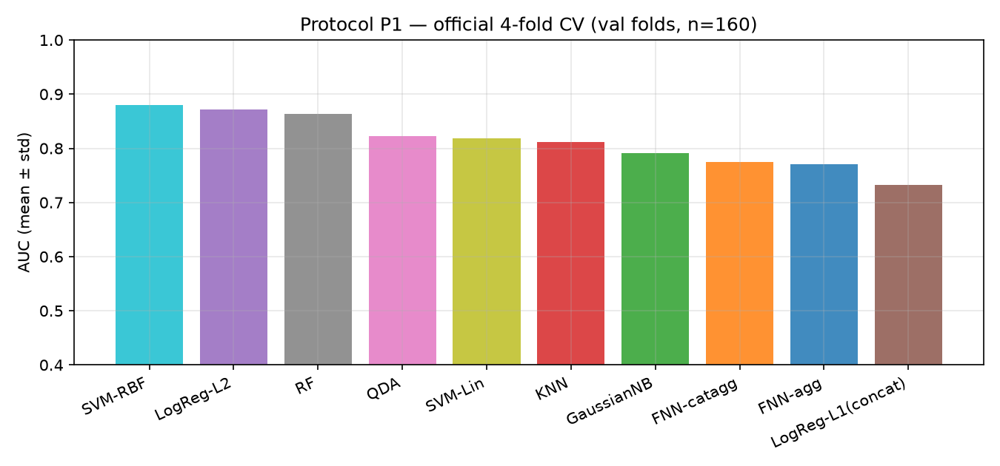


Best validation AUC: **SVM-RBF 0.8793** — above every traditional baseline of
the EMS paper (best: ESR_SVM 0.8498) and within 2 points of the deep MSNet
(0.8972).

### Protocol P2 — 120 / 40 subject split (held-out test, n = 40, 3 split seeds)


Best test AUC: **LogReg-L2 0.9075** on the 40 held-out subjects
(mean ± std over 3 stratified seeds).

### Takeaways for the hand-crafted pipeline

1. Spatial spread + saccade + pupil statistics aggregated (mean/std) over the
   100 stimuli contain most of the discriminative information (AUC ≈ 0.87–0.91).
2. A basic FNN (AUC ≈ 0.75–0.77) does not beat regularized linear models on
   120–160 training subjects — classic small-tabular-data regime.
3. The EDB-style 4,500-dim per-stimulus concatenation (LogReg-L1) is the
   weakest representation (AUC ≈ 0.73–0.74): it overfits at this sample size.

Full result tables, comparison with the paper benchmark, and reproduction
commands: [`../baseline/04_results.md`](../baseline/04_results.md).
