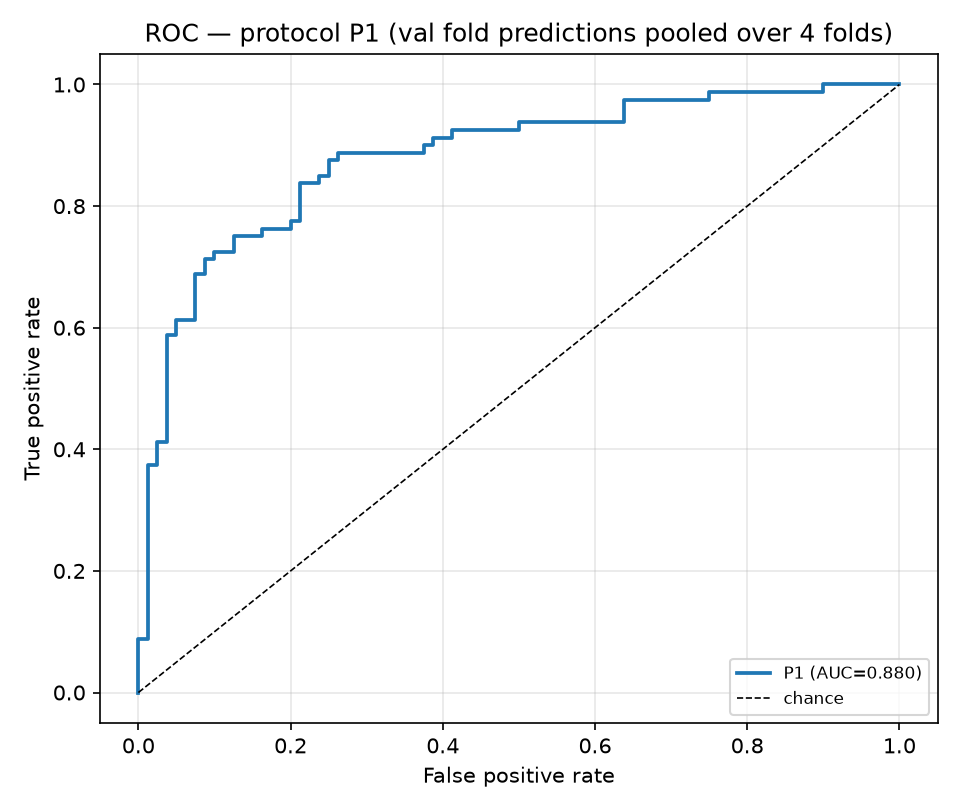
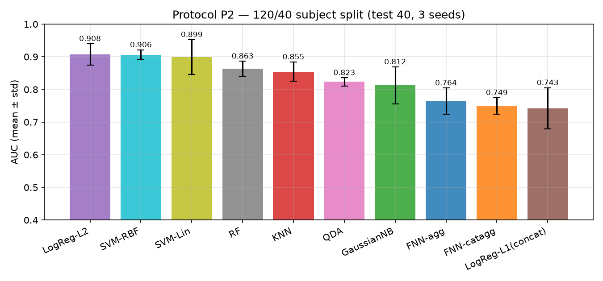
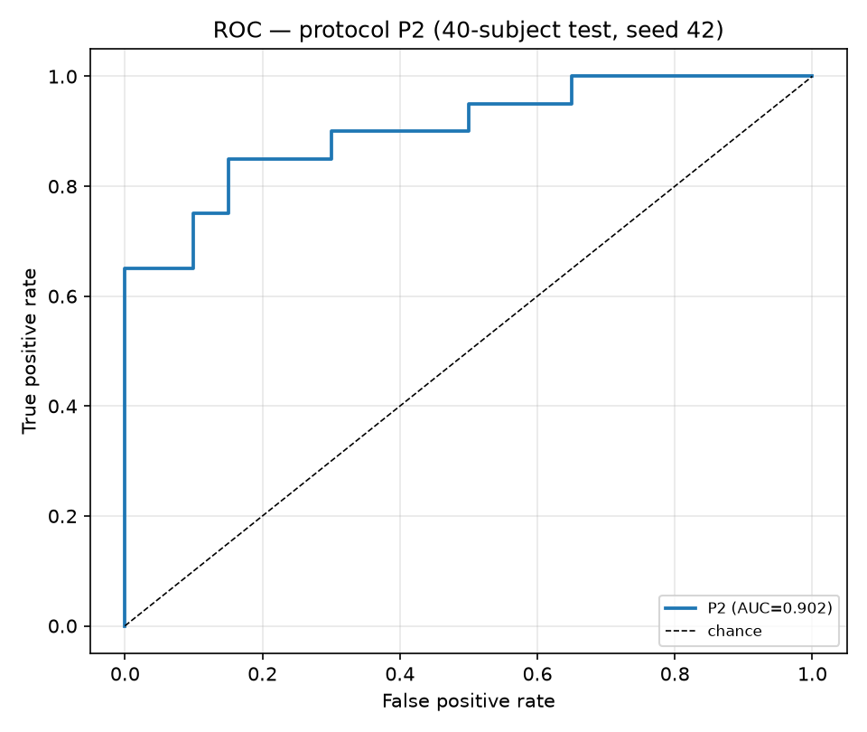

# 04 — Experiment Results

All experiments use the 45 spatial+temporal hand-crafted features
([feature doc](../../docs/EDA/README.md) — Section 6) and a fixed
**threshold of 0.5** for every classification metric (AUC is threshold-free).
Run details in [03_protocols.md](03_protocols.md); raw outputs in
`docs/baseline/results/` (per-run `metrics.json`, per-subject predictions,
aggregate `summary.csv`).

## Protocol P1 — official EMS 4-fold cross-validation

Validation fold metrics, mean ± std over the 4 official folds (160 subjects):

| Method | Rep | Acc | Sen | Spe | Pre | F1 | AUC |
|---|---|---|---|---|---|---|---|
| SVM-RBF | agg | 0.7938±0.074 | 0.8031 | 0.7819 | 0.7886 | 0.7954 | **0.8793**±0.060 |
| LogReg-L2 | agg | 0.8062±0.057 | 0.8134 | 0.8000 | 0.8072 | 0.8074 | 0.8711±0.069 |
| RF | agg | **0.8125**±0.057 | 0.7957 | 0.8167 | 0.8307 | 0.8061 | 0.8631±0.055 |
| QDA | agg | 0.7125±0.096 | 0.7494 | 0.6847 | 0.7057 | 0.7225 | 0.8229±0.075 |
| SVM-Lin | agg | 0.7438±0.076 | 0.7511 | 0.7389 | 0.7451 | 0.7453 | 0.8189±0.066 |
| KNN | agg | 0.7312±0.107 | 0.6892 | 0.7729 | 0.7399 | 0.7078 | 0.8120±0.086 |
| GaussianNB | agg | 0.7125±0.028 | 0.6264 | 0.7812 | 0.7531 | 0.6756 | 0.7913±0.037 |
| FNN-catagg | catagg | 0.7000±0.047 | 0.6063 | 0.7479 | 0.7318 | 0.6111 | 0.7752±0.062 |
| FNN-agg | agg | 0.6312±0.082 | 0.4230 | 0.8229 | 0.8688 | 0.4943 | 0.7700±0.048 |
| LogReg-L1 | concat | 0.6875±0.065 | 0.7179 | 0.6583 | 0.6818 | 0.6872 | 0.7328±0.085 |




## Protocol P2 — 120 / 40 subject split

Metrics on the 40-subject held-out test set, mean ± std over 3 stratified split
seeds (42 / 2024 / 2026):

| Method | Rep | Acc | Sen | Spe | Pre | F1 | AUC |
|---|---|---|---|---|---|---|---|
| LogReg-L2 | agg | **0.8250**±0.025 | 0.7833 | 0.8667 | 0.8578 | 0.8164 | **0.9075**±0.033 |
| SVM-RBF | agg | 0.8167±0.052 | 0.7833 | 0.8500 | 0.8575 | 0.8124 | 0.9058±0.015 |
| SVM-Lin | agg | 0.8250±0.050 | 0.7833 | 0.8667 | 0.8553 | 0.8138 | 0.8992±0.053 |
| RF | agg | 0.7917±0.014 | 0.8000 | 0.7833 | 0.7956 | 0.7927 | 0.8633±0.023 |
| KNN | agg | 0.8000±0.025 | 0.7167 | 0.8833 | 0.8743 | 0.7822 | 0.8546±0.030 |
| QDA | agg | 0.7167±0.052 | 0.7167 | 0.7167 | 0.7240 | 0.7180 | 0.8233±0.013 |
| GaussianNB | agg | 0.7333±0.052 | 0.6833 | 0.7833 | 0.7618 | 0.7201 | 0.8125±0.057 |
| FNN-agg | agg | 0.6500±0.075 | 0.7500 | 0.5500 | 0.6573 | 0.6787 | 0.7642±0.040 |
| FNN-catagg | catagg | 0.6750±0.066 | 0.7500 | 0.6000 | 0.6926 | 0.6947 | 0.7492±0.026 |
| LogReg-L1 | concat | 0.7167±0.014 | 0.6833 | 0.7500 | 0.7320 | 0.7067 | 0.7425±0.063 |





## Comparison with the EMS paper benchmark

The paper's traditional baselines use their own hand-crafted statistics on the
same official folds (validation set, threshold tuned by Otsu per fold — ours is
fixed at 0.5):

| Method | Val Acc | Val AUC | Source |
|---|---|---|---|
| EDB_SVM | 0.7313 | 0.8086 | paper Table IV |
| EDB_QDA | 0.7063 | 0.7205 | paper Table IV |
| EDB_BYS | 0.7000 | 0.7987 | paper Table IV |
| ESR_SVM | 0.7938 | 0.8498 | paper Table IV |
| ESR_RF | 0.7625 | 0.8521 | paper Table IV |
| MSNet (deep, saliency features) | 0.8313 | 0.8972 | paper Table IV |
| **Ours — SVM-RBF (45 hand-crafted)** | **0.7938** | **0.8793** | P1 |
| **Ours — RF** | **0.8125** | **0.8631** | P1 |
| **Ours — LogReg-L2** | **0.8062** | **0.8711** | P1 |

- Our hand-crafted baselines **match or exceed every traditional baseline of the
  paper** on the official folds, and our best AUC (0.8793) is within 2 points of
  MSNet (0.8972), which uses a fine-tuned saliency network (RINet) for feature
  extraction — despite our fixed 0.5 threshold (the paper tunes Otsu per fold).
- On P2 the best model (LogReg-L2) reaches 0.9075 test AUC on the 40 held-out
  subjects. *Not directly comparable* to the paper's official test numbers
  (different test subjects, whose labels are withheld), but shows the feature
  set generalizes to a subject-disjoint test split.

## Key observations

1. **Logistic regression / SVM with RBF on the aggregated 90-dim statistics are
   the strongest simple baselines** (AUC ≈ 0.87–0.91) — the aggregated spatial
   spread, saccade and pupil statistics carry most of the discriminative signal.
2. **The basic FNN underperforms the linear models** (AUC ≈ 0.75–0.77) on this
   small tabular dataset (120–160 training subjects); at threshold 0.5 its
   sigmoid outputs are miscalibrated, hurting sensitivity. Regularized linear
   models remain the reference point for hand-crafted features on EMS.
3. The **concat (4,500-dim) + L1** representation (EDB-style) is the weakest —
   per-stimulus concatenation overfits at this sample size even with L1.
4. Threshold 0.5 (fixed) yields balanced Sen/Spe for the top methods; the paper
   reports threshold-optimized numbers, so Acc differences vs the paper are
   partly due to the fixed threshold, AUC is directly comparable.

## Reproduction commands

```bash
# --- data prep (from repo root /root/EMS-Minh) ---
python src/eda.py                                  # EDA figures + stats -> docs/EDA
python src/preprocess.py                           # clean + 45 features -> processed_dataset/

# --- baselines (code in EMS-Minh/src/baseline) ---
cd src/baseline

# one method, one protocol
python run_experiment.py --method svm_rbf --protocol P1           # official 4-fold
python run_experiment.py --method svm_rbf --protocol P2 --seed 42 # 120/40 split
python run_experiment.py --method fnn    --protocol P2 --seed 42  # basic FNN

# full suite (10 methods x P1 + 10 methods x 3-seed P2) -> results/summary.csv
python run_all.py
python run_all.py --methods svm_rbf,lr,rf --protocols P1          # subset

# figures (AUC bars + ROC curves) -> results/figures/
python plot_results.py
```

Results of every run: `docs/baseline/results/{P1,P2}/{method}__{rep}/seed{seed}/`
(`metrics.json`, per-subject predictions; P1 also writes
`official_test_preds.csv` for the 48 withheld test subjects).
